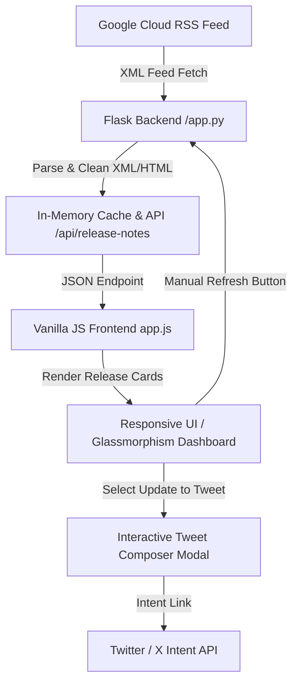

# Implementation Plan: BigQuery Release Notes Web App

A modern web application built with **Python Flask** and **plain Vanilla HTML, CSS, JavaScript** to fetch, display, filter, and tweet BigQuery release notes directly from Google Cloud's official RSS feed.



---

## 🏗️ Architecture & Technology Stack

| Layer | Technology | Description |
| :--- | :--- | :--- |
| **Backend** | Python 3 + Flask | Serves API endpoints, handles RSS XML parsing (`urllib`, `bs4`, `xml.etree`), caching, and tweet formatting helpers. |
| **Frontend UI** | HTML5 + Vanilla CSS3 | Modern design system, CSS grid/flexbox, HSL color tokens, dark/light themes, smooth micro-animations. |
| **Client Logic** | Vanilla JavaScript (ES6+) | Async Fetch API, dynamic DOM rendering, live search/filter, spinner state management, localStorage bookmarks. |
| **Integrations** | Twitter / X Web Intent | Direct intent link generation (`https://twitter.com/intent/tweet?text=...`) for one-click tweeting. |

---

## 🛠️ Key Features & User Experience

### 1. BigQuery Feed Fetcher & Parser
- Fetches live XML feed from `https://docs.cloud.google.com/feeds/bigquery-release-notes.xml`.
- Splits updates by date entry and category sections (`Feature`, `Changed`, `Deprecated`, `Fix`, `Announcement`).
- Extracts plain text summaries, fixes relative documentation links, and pre-calculates tweet drafts.
- Implements server-side caching (5-minute TTL) with an override option for force refreshes.

### 2. Dashboard UI & Refresh Spinner
- **Header Toolbar**: Brand logo, connection status indicator, live entry count.
- **Refresh Button with Spinner**: Interactive button with spinning CSS animation during fetch, triggering client-side feed reloading without full page refresh.
- **Search & Filtering**:
  - Real-time text search across update titles, text, and dates.
  - Category pill filters (`All`, `Feature`, `Changed`, `Deprecated`, `Fix`).
  - Sort toggle (`Newest First` / `Oldest First`).
- **Theme Switcher**: Smooth transition between Dark mode and Light mode.

### 3. Release Note Cards & Actions
- Clean card layout with date headers, category badges (color-coded), formatted HTML body, and source link anchor.
- Action Bar per update card:
  - 🐦 **Tweet This Update**: Launches the Tweet Composer modal loaded with pre-formatted update text.
  - 📋 **Copy Link / Text**: Quick clipboard copy with feedback toast.
  - 🔖 **Bookmark**: Save favorite updates to local storage for quick access.

### 4. Interactive Tweet Composer Modal
- Realistic X / Twitter tweet draft box preview.
- Character counter with progress indicator (warns near 280-character limit).
- Quick Hashtag Toggles: `#BigQuery`, `#GoogleCloud`, `#DataEngineering`, `#GCP`, `#DataWarehouse`.
- "Post on X" button opening standard Twitter intent URL with pre-filled text.

---

## 📅 Step-by-Step Implementation Steps

### Step 1: Project Setup & Virtual Environment
- Verify virtualenv created with required dependencies (`Flask`, `requests`, `beautifulsoup4`).
- Organize project folder structure:
  ```
  bq-releases-notes/
  ├── app.py
  ├── static/
  │   ├── css/
  │   │   └── style.css
  │   └── js/
  │       └── app.js
  ├── templates/
  │   └── index.html
  └── venv/
  ```

### Step 2: Flask API & RSS Parser (`app.py`)
- Implement feed fetching with fallback error handling.
- Write BeautifulSoup + XML parser to break down entries into clean section cards.
- Implement `/api/release-notes` (supports `?refresh=true`).
- Implement `/api/tweet-draft` to format custom tweet text for specific update IDs.

### Step 3: Core UI & CSS Styling System (`templates/index.html`, `static/css/style.css`)
- Build semantic HTML structure with accessible markup and meta tags.
- Define CSS custom properties (colors, HSL variables for dark/light themes, typography, shadows).
- Style top navigation bar, feed control panel, filter pills, loading spinner, and card stream.

### Step 4: Interactive Frontend JavaScript (`static/js/app.js`)
- Write async fetch handler for `/api/release-notes`.
- Implement Refresh button behavior (adds `.spinning` class, fetches data, updates DOM, removes spinner).
- Implement filter & search logic.
- Implement Tweet Modal logic with dynamic character calculation, hashtag appending, and X Intent opening.

### Step 5: Verification & Testing
- Start Flask dev server on local port.
- Test feed parsing, refresh button spinner, search/category filtering, theme toggle, and tweet link creation.
